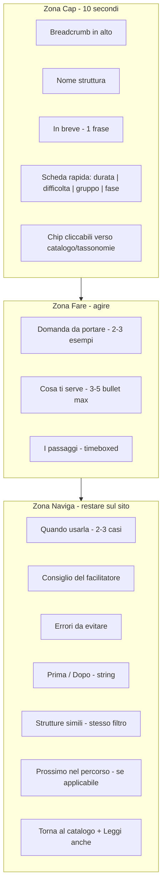

# Revisione architettura schede struttura

## Diagnosi (stato attuale)

Il template in `[content/02-template.md](content/02-template.md)` e le bozze in `[content/strutture/](content/strutture/)` seguono un flusso lineare a 7 blocchi:

`In breve → Quando usarla → Passaggi → Consiglio → Errori → Combinala con → Leggi anche → breadcrumb`

**Cosa funziona:** tono operativo, passaggi numerati, link finali (es. `[1-2-4-all.md](content/strutture/1-2-4-all.md)`).

**Cosa limita praticita' e navigazione:**


| Problema                                                 | Effetto                                                                                                                                            |
| -------------------------------------------------------- | -------------------------------------------------------------------------------------------------------------------------------------------------- |
| Metadati solo in YAML (`durata`, `difficolta`, `fase`)   | Il lettore non vede subito se la struttura e' adatta al suo contesto                                                                               |
| Mancano **domanda generativa** e **preparazione minima** | Sezioni presenti nel sito live (`[sitemap-enriched.json](sitemap-enriched.json)` keys `domanda_generativa`, `preparazione`) ma assenti nelle bozze |
| **Passaggi** lontani dall'above-the-fold                 | Chi vuole agire subito deve scorrere                                                                                                               |
| **Combinala con** vs **Leggi anche** senza regole chiare | Link spesso senza motivo (es. `[troika-consulting.md](content/strutture/troika-consulting.md)`)                                                    |
| Navigazione solo in coda                                 | Breadcrumb e correlati compariono dopo molto scroll                                                                                                |
| Nessun **prev/next** nei percorsi guidati                | Chi arriva da "Per iniziare subito" non ha un filo logico                                                                                          |


---

## Nuovo modello: tre zone




### Principi guida

1. **Praticita'**: sopra la piega compaiono risposta ("a cosa serve?"), vincoli (tempo, difficolta', gruppo) e subito **cosa chiedere** + **cosa preparare** + **passaggi**.
2. **Semplicita' di fruizione**: massimo 5 sezioni H2 visibili; preparazione condensata (no wall of text); passaggi con verbo imperativo + tempo a destra; per strutture lunghe (>6 passaggi) raggruppare in sotto-fasi.
3. **Navigazione**: breadcrumb **in alto**; chip tassonomia cliccabili; moduli di link con **regole fisse** e anchor text che spiega il perche'; prev/next quando la struttura appartiene a un percorso guidato.

---

## Nuovo template scheda (contenuto)

File da aggiornare: `[content/02-template.md](content/02-template.md)`, sezione corrispondente in `[.cursor/skills/liberating-tone-of-voice/SKILL.md](.cursor/skills/liberating-tone-of-voice/SKILL.md)`.

```markdown
# {Nome struttura}

[Home](/) > [Le strutture](/structures/) > {Nome}

**In breve** - {1 frase beneficio}

| Durata | Difficolta' | Gruppo | Fase |
|--------|-------------|--------|------|
| 15 min | Facile | illimitato | Ideate |

**Percorso:** [Per iniziare subito](/complessita/iniziare-subito/) · [Facile](/difficolta/facile/) · [Breve](/durata/breve/)

## Domanda da portare

- "{esempio concreto}"
- "{esempio concreto}"

## Cosa ti serve

- {spazio / materiali / remoto - max 5 bullet}

## I passaggi

1. {azione} — {tempo}
...

## Quando usarla

- {caso d'uso / dolore}

## Il consiglio del facilitatore

{2-4 frasi}

## Errori da evitare

- {errore}

## Prima e dopo

- **Prima:** [{Struttura}](/structures/{slug}/) — {perche'}
- **Dopo:** [{Struttura}](/structures/{slug}/) — {perche'}

## Strutture simili

- [{Nome}](/structures/{slug}/) — {stesso livello o durata}

## Prossimo nel percorso

→ [{Struttura successiva}](/structures/{slug}/) (solo se in percorso guidato)

## Torna al catalogo

[Esplora tutte le strutture](/structures/) · [Generare idee](/...) · [{altra correlata}](/structures/{slug}/)
```

**Regole sui moduli di navigazione (sostituiscono Combinala con / Leggi anche):**


| Modulo                    | Quando                       | Quanti link                                 |
| ------------------------- | ---------------------------- | ------------------------------------------- |
| **Prima e dopo**          | Sempre                       | 1-2 ciascuno, con motivo esplicito (string) |
| **Strutture simili**      | Sempre                       | 2-3, stessa difficolta' o durata simile     |
| **Prossimo nel percorso** | Solo se in hub `complessita` | 1 link avanti (+ opzionale indietro)        |
| **Torna al catalogo**     | Sempre                       | 1 link catalogo + 1-2 correlati per bisogno |


Percorsi prev/next da `[content/01-architettura.md](content/01-architettura.md)`:

- Per iniziare subito: Impromptu Networking → 1-2-4-All → W³ → 15% Solutions → Troika Consulting

---

## Aggiornamenti ai documenti di riferimento

### `[content/01-architettura.md](content/01-architettura.md)`

- Riscrivere sezione "Struttura pagina scheda" con il modello a 3 zone.
- Aggiungere tabella mapping **modulo → obiettivo navigazione**.
- Documentare **chip tassonomia** in scheda rapida (link a `/difficolta/`, `/durata/`, `/design-thinking/`, `/complessita/`).
- Estendere matrice correlazione con colonne Prima / Dopo / Simili / Percorso.

### `[scripts/generate_structure_drafts.py](scripts/generate_structure_drafts.py)`

Estendere estrazione da `indexes.structures[].informative_summary`:

- `domanda_generativa.example_questions` → sezione **Domanda da portare**
- `preparazione.space_and_setup` (max 5 voci) → **Cosa ti serve**
- `taxonomies` → tabella scheda rapida + chip link
- `RELATED` → rinominare in `BEFORE_AFTER` + `SIMILAR` + `PATH_NEXT` (dict per percorso guidato)
- Formattazione passaggi: sempre `{azione} — {tempo}`, raggruppare fasi se >6 step

### 41 bozze in `[content/strutture/](content/strutture/)`

- Rigenerare con script aggiornato.
- **Eccezione:** `[1-2-4-all.md](content/strutture/1-2-4-all.md)` resta reference manuale; adattarla per prima al nuovo template e usarla come gold standard per la revisione delle altre.

---

## Ordine di implementazione

1. Definire template finale in `02-template.md` + skill (single source of truth).
2. Aggiornare `01-architettura.md` (sezione scheda + percorsi prev/next).
3. Estendere `generate_structure_drafts.py` con nuove sezioni e moduli nav.
4. Riscrivere manualmente `1-2-4-all.md` come esempio completo.
5. Rigenerare le altre 40 schede; pass di QA su 5 campioni (facile / intermedia / avanzata / lunga / percorso guidato).
6. Checklist rapida per ogni scheda: metadati visibili, domanda presente, link con motivo, nessun modulo vuoto.

---

## Criteri di accettazione

- Entro 10 secondi di scroll il lettore vede: cosa fa, quanto dura, quanto e' difficile, domanda esempio, primi passaggi.
- Ogni scheda ha almeno 4 link interni **contestualizzati** (non solo nomi struttura).
- Ogni link in Prima/Dopo/Simili include il perche' in 5-10 parole.
- Strutture del percorso "Per iniziare subito" espongono prev/next.
- Chip tassonomia portano al catalogo filtrato (URL gia' definiti in architettura).

