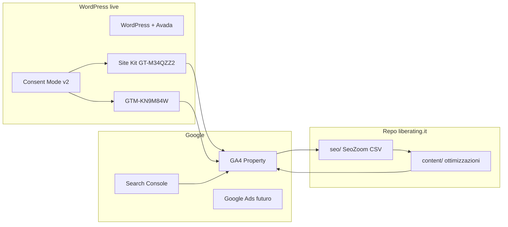

# Piano configurazione GA4 per SEO e GEO — liberating.it

## Situazione attuale (audit)


| Elemento            | Stato                                                                                                     | Problema                                                                                                                                                                            |
| ------------------- | --------------------------------------------------------------------------------------------------------- | ----------------------------------------------------------------------------------------------------------------------------------------------------------------------------------- |
| **Google Site Kit** | Attivo (v1.180.0)                                                                                         | Config base, nessun evento custom                                                                                                                                                   |
| **Google Tag**      | `GT-M34QZZ2` via gtag                                                                                     | ID corretto ma senza eventi SEO                                                                                                                                                     |
| **GTM**             | `GTM-KN9M84W` (noscript)                                                                                  | Rischio **doppio conteggio** con Site Kit                                                                                                                                           |
| **Conversioni**     | 0 in `[seo/landing-pages-all_2026-05-18_2026-06-15.csv](seo/landing-pages-all_2026-05-18_2026-06-15.csv)` | Nessun obiettivo definito                                                                                                                                                           |
| **Eventi custom**   | Non implementati                                                                                          | Previsti in `[.cursor/plans/piano_seo_operativo_a2c0a0e2.plan.md](.cursor/plans/piano_seo_operativo_a2c0a0e2.plan.md)`: `view_structure`, `start_path_iniziare_subito`, `scroll_75` |
| **Search Console**  | Non collegata nel repo                                                                                    | Gap critico per correlare query → landing → engagement                                                                                                                              |
| **Consent Mode**    | Assente                                                                                                   | Richiesto dall'utente; necessario per GDPR + ads futuri                                                                                                                             |
| **Dati anomali**    | `(not set)` = 24 sessioni, bounce 95.8%                                                                   | Probabile traffico senza page_view o redirect; da investigare                                                                                                                       |


**Traffico utile già visibile** (ultimo export GA, mag–giu 2026):

- Home: 98 sessioni, bounce 52%
- Schede forti: `/structures/1-2-4-all` (bounce 36%), `/structures/troika-consulting` (durata 537s)
- Hub strategico: `/complessita/iniziare-subito` (6 sessioni, bounce 33% — da monitorare post-ottimizzazione GEO)

**Priorità GEO** (da `[seo/liberating_it_PagesWithPotential.csv](seo/liberating_it_PagesWithPotential.csv)`): pagine con traffico potenziale alto e `Menzioni AI = 0` — es. OST, social-network-webbing, w3, hub `iniziare-subito`.




---

## Fase 0 — Consolidare il tracking (evitare doppi conteggi)

**Decisione architetturale consigliata:** GTM come **unico punto di deploy** per tag custom; Site Kit solo per connessione GA4/GSC e tag base, oppure disattivare il tag Site Kit se GTM gestisce tutto.

### Azioni in WordPress / GTM

1. **Verifica in GA4 → Admin → Data Streams → DebugView**: apri il sito e controlla se ogni `page_view` arriva **una o due volte**. Se duplicate → disattiva il tag Analytics in Site Kit *oppure* rimuovi il tag GA4 duplicato in GTM (tenere una sola sorgente).
2. **In GTM** (`GTM-KN9M84W`): crea container structure:
  - Tag: GA4 Configuration (Measurement ID dalla property collegata a Site Kit)
  - Trigger: All Pages (dopo consenso analytics)
  - Variabili: `Page Path`, `Page Title`, `Referrer`, custom data layer vars (fase 2)
3. **Site Kit**: collega Search Console alla stessa property GA4 (Integrations → Search Console). Abilita "Enhanced measurement" (scroll, outbound clicks, site search se presente).

### Deliverable repo (documentazione)

Creare `[docs/ga4-setup.md](docs/ga4-setup.md)` con: ID property, container GTM, mappa tag/trigger, checklist anti-duplicazione. Non contiene segreti — solo riferimenti configurabili.

---

## Fase 1 — Consent Mode v2 (GDPR)

L'utente ha scelto Consent Mode v2. Implementazione consigliata:

### 1. Banner cookie su WordPress

Plugin CMP compatibile Consent Mode v2 (es. **Complianz**, **Cookiebot**, **CookieYes** — scegliere uno già usato o preferito). Requisiti:

- Categorie: Necessari / Analytics / Marketing
- Default EEA: analytics = `denied` fino al consenso
- Integrazione nativa o script Consent Mode

### 2. Script Consent Mode (prima di gtag/GTM)

Inserire **in `<head>`, prima di qualsiasi tag Google**, via GTM Custom HTML o hook WP:

```javascript
window.dataLayer = window.dataLayer || [];
function gtag(){dataLayer.push(arguments);}
gtag('consent', 'default', {
  analytics_storage: 'denied',
  ad_storage: 'denied',
  ad_user_data: 'denied',
  ad_personalization: 'denied',
  wait_for_update: 500
});
```

Al consenso analytics del CMP → `gtag('consent', 'update', { analytics_storage: 'granted' })`.

### 3. Aggiornare privacy policy

In `[content/v1/pagine/privacy-policy.md](content/v1/pagine/privacy-policy.md)`: sostituire "Google Analytics (se presente)" con testo esplicito (servizio attivo, finalità SEO/miglioramento contenuti, base giuridica consenso per analytics, link policy Google). Pubblicare su WP dopo revisione legale.

### 4. Verifica

GA4 → Admin → Consent settings: verificare che Consent Mode sia rilevato. Test con Tag Assistant / DebugView da IP EEA simulato.

---

## Fase 2 — Eventi e dimensioni custom per SEO/GEO

Obiettivo: misurare **quali contenuti funzionano** (engagement reale), non solo pageview, e collegarli alle priorità SeoZoom.

### Custom dimensions (GA4 Admin → Custom definitions)


| Dimensione            | Scope | Fonte                                                    | Uso SEO/GEO                          |
| --------------------- | ----- | -------------------------------------------------------- | ------------------------------------ |
| `content_type`        | Event | `structure` / `hub` / `taxonomy` / `page`                | Segmentare report per tipo contenuto |
| `structure_slug`      | Event | slug da URL `/structures/{slug}/`                        | Performance per scheda LS            |
| `taxonomy_facet`      | Event | `complessita`, `difficolta`, `durata`, `design-thinking` | Efficacia hub tassonomici            |
| `has_faq`             | Event | boolean (quando FAQ live)                                | Correlare FAQ JSON-LD con engagement |
| `scroll_depth_bucket` | Event | 25/50/75/90                                              | Proxy "contenuto letto" per GEO      |


Registrare in GA4 **prima** di inviare eventi (altrimenti i dati storici non hanno la dimensione).

### Eventi custom (via GTM)


| Evento                       | Trigger                                             | Parametri                                  | Collegamento piano SEO                           |
| ---------------------------- | --------------------------------------------------- | ------------------------------------------ | ------------------------------------------------ |
| `view_structure`             | Pageview su `/structures/`*                         | `structure_slug`, `content_type=structure` | Misura schede prioritarie (Batch 1–3)            |
| `view_hub`                   | Pageview su `/complessita/`*, `/difficolta/*`, ecc. | `taxonomy_facet`, slug                     | Hub `iniziare-subito` e tassonomie               |
| `scroll_75`                  | Scroll depth 75% (GTM o Enhanced)                   | `page_path`                                | Engagement profondo = segnale contenuto citabile |
| `internal_link_click`        | Click su link interni liberating.it                 | `link_url`, `link_text`, `from_page`       | Efficacia internal linking SEO                   |
| `start_path_iniziare_subito` | Click CTA verso `/complessita/iniziare-subito/`     | `from_page`                                | Percorso "iniziare domani"                       |
| `faq_visible`                | Elemento FAQ in viewport (opzionale, post-FAQ live) | `structure_slug`                           | Validazione impatto FAQ GEO                      |


**Implementazione GTM consigliata** per `view_structure`:

- Trigger: Page Path matches RegEx `^/structures/[^/]+/?$`
- Tag: GA4 Event, name `view_structure`, parameter `structure_slug` = variabile URL estratta con Lookup/RegEx

### Conversioni (GA4 → Events → Mark as conversion)

Segnare come conversioni (micro-conversioni, utili per remarketing e ottimizzazione contenuti):

1. `scroll_75` — lettura approfondita
2. `view_structure` con `engagement_time > 30s` (evento derivato o audience)
3. `start_path_iniziare_subito` — intent navigazione verso hub
4. (Futuro) `generate_lead` — submit form contatto

Allineato a [piano SEO operativo — Setup tecnico pre-lancio ads](.cursor/plans/piano_seo_operativo_a2c0a0e2.plan.md).

---

## Fase 3 — Search Console + reporting integrato

### Collegamento GSC ↔ GA4

Via Site Kit o GA4 Admin → Product links → Search Console. Abilita report:

- **Queries** (query → landing page → engagement)
- **Organic Google Search** in GA4 Explorations

### Esplorazioni GA4 da creare (template)

1. **SEO Landing Performance**: dimensioni `Landing page` + `Session source/medium` (google/organic) + metriche `Engaged sessions`, `Average engagement time`, `scroll_75` count
2. **Structure Cards Scorecard**: filtro `content_type=structure`, breakdown per `structure_slug`, ordinato per sessioni e bounce
3. **GEO Priority Monitor**: landing delle URL in `PagesWithPotential.csv` con `Menzioni AI=0`, metrica `scroll_75` e `engagement rate`
4. **Internal linking**: report `internal_link_click` per capire quali anchor/porte funzionano

### Ciclo operativo mensile (repo + GA4)

Documentare in `[docs/ga4-seo-geo-reporting.md](docs/ga4-seo-geo-reporting.md)`:

1. Esporta da GA4: landing pages, exit pages, eventi custom (sostituisce export manuale in `seo/landing-pages-all_*.csv`)
2. Incrocia con SeoZoom: `[dati-seozoom.md](.cursor/skills/seo-geo-specialist/dati-seozoom.md)` — `PagesWithPotential`, `PagesWithTrafficDown`, CSV per-URL
3. **Regola decisionale**:
  - Pos SeoZoom 4–20 + bounce GA > 60% → priorità riscrittura on-page (skill seo-geo)
  - Traffico GA alto + `Menzioni AI=0` → priorità FAQ/GEO answer-first
  - `scroll_75` basso su scheda con Pos 1–3 → problema UX/layout, non keyword
4. Aggiorna tracker batch SEO quando disponibile (`[content/seo-batch-tracker.md](content/seo-batch-tracker.md)` — da creare nel piano operativo)

### Fix dati `(not set)`

In GA4 → Reports → Landing page: investigare `(not set)`. Cause tipiche:

- Redirect senza page_view
- LiteSpeed cache + tag differiti
- Traffico bot/direct malformato

Azione: GTM tag GA4 Configuration con `send_page_view: true` su tutte le pagine; escludere bot noti in GA4 Admin → Data Settings → Data Filters.

---

## Fase 4 — Preparazione Google Ads e remarketing (opzionale, post-GA4)

Quando attivi campagne dal [piano SEO operativo](.cursor/plans/piano_seo_operativo_a2c0a0e2.plan.md):

1. Collega GA4 ↔ Google Ads (stessa account)
2. Importa conversioni: `scroll_75`, `start_path_iniziare_subito`
3. Crea audience GA4: "2+ view_structure in 30 giorni" + "engagement > 30s su home"
4. Consent Mode: `ad_storage` granted solo se utente accetta marketing

---

## Fase 5 — Validazione e manutenzione

### Checklist go-live (1–2 ore)

- [ ] Un solo page_view per navigazione (no duplicati)
- [ ] Consent Mode: default denied, update on accept
- [ ] DebugView: `view_structure` su scheda test (es. `/structures/triz/`)
- [ ] `scroll_75` su pagina lunga (home o principi)
- [ ] GSC dati visibili in GA4 (attesa 24–48h)
- [ ] Custom dimensions popolate in Realtime
- [ ] Privacy policy aggiornata e pubblicata

### Manutenzione trimestrale

- Riesportare landing/exit in `seo/` (convenzione data nel filename)
- Verificare che nuove URL (hub tassonomici, FAQ live) generino eventi corretti
- Rivedere conversioni e audience prima di campagne ads

---

## Cosa NON è in questo repo

Il codice WordPress/GTM **non vive** in questo workspace. Le modifiche si fanno in:

- **WP Admin** → Site Kit, plugin CMP, eventuale snippet PHP minimo per dataLayer
- **GTM UI** → tag, trigger, variabili
- **GA4 UI** → custom definitions, conversioni, explorations, link GSC

Il repo riceve solo **documentazione** (`docs/ga4-*.md`) e continua a usare `seo/` per export periodici che alimentano la skill `[seo-geo-specialist](.cursor/skills/seo-geo-specialist/SKILL.md)`.

---

## Ordine di esecuzione consigliato

1. Fase 0 (dedupe) — 30 min, impatto immediato su affidabilità dati
2. Fase 1 (Consent Mode) — 2–3 ore, prerequisito legale
3. Fase 2 (eventi + dimensioni) — 3–4 ore, cuore SEO/GEO
4. Fase 3 (GSC + explorations + doc reporting) — 2 ore
5. Fase 4–5 quando serve ads o dopo 2–4 settimane di dati puliti

