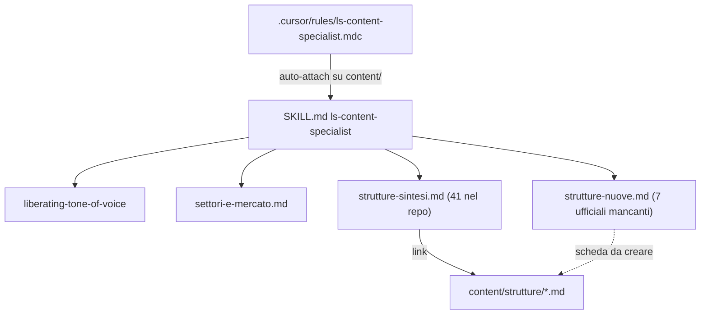

# LS Content Specialist

Aggiungo un agente specializzato nelle Liberating Structures, coerente con l'impianto a skill gia' presente in [.cursor/skills/liberating-tone-of-voice/SKILL.md](.cursor/skills/liberating-tone-of-voice/SKILL.md). L'agente padroneggia il repertorio LS (menu ufficiale), lo semplifica e lo adatta a liberating.it.

## Forma scelta

Skill + Rule:

- La **Skill** porta metodo e conoscenza (richiamabile per nome o in automatico).
- La **Rule** la aggancia in automatico quando si lavora sui contenuti in `content/`.

## File da creare

- `.cursor/skills/ls-content-specialist/SKILL.md` (corpo < 500 righe)
  - Frontmatter: `name: ls-content-specialist`, `description` in terza persona con trigger ("Liberating Structures", "scheda struttura", "adatta una struttura", "content/strutture").
  - Ruolo e 4 obiettivi (semplice da applicare, dettagliata e specifica, multi-settore, mercato italiano).
  - Le 4 lenti di adattamento e il flusso operativo (crea/adatta una struttura).
  - Rimando obbligatorio a [liberating-tone-of-voice](.cursor/skills/liberating-tone-of-voice/SKILL.md) e ai template in [content/02-template.md](content/02-template.md) e [content/01-architettura.md](content/01-architettura.md).
  - Link (un livello) ai due file di riferimento sotto + checklist finale.
- `.cursor/skills/ls-content-specialist/settori-e-mercato.md`
  - Playbook di adattamento per settore/industria (azienda, scuola/formazione, terzo settore, PA, sanita', vendite/retail, tech) con esempi di domanda e contesto per ognuno.
  - Regole "mercato italiano": cultura delle riunioni IT, gerarchia, remoto/ibrido, lessico, esempi locali; rinvio alle regole anti-AS-AI di [scrittura-naturale.md](.cursor/skills/liberating-tone-of-voice/scrittura-naturale.md).
- `.cursor/skills/ls-content-specialist/strutture-sintesi.md`
  - Base di conoscenza per le 41 strutture presenti in `content/strutture/`, allineate ai nomi del menu ufficiale (con alias, es. TRIZ = Creative Destruction).
  - Per ciascuna: nome IT/EN + slug, scopo in una riga, fase/durata/difficolta', quando usarla, passaggi essenziali con tempi, esempio di domanda, dove brilla per settore, nota mercato italiano, abbinamenti (string: prima/dopo/simili), link alla scheda esistente `/structures/{slug}/`.
- `.cursor/skills/ls-content-specialist/strutture-nuove.md`
  - Le 7 strutture del menu ufficiale ancora assenti da liberating.it: A Door Opens, Folding Spectrogram, Future-Present, Grief Walking, Options & Place, Positive Gossip, Strategy Knotworking.
  - Stesso formato di sintesi, piu' un flag "scheda da creare" e lo slug proposto per `content/strutture/`, cosi' diventano candidate naturali per nuove schede.
- `.cursor/rules/ls-content-specialist.mdc`
  - Frontmatter `description` + `globs: content/**/*.md` (auto-attach) che istruisce ad applicare la skill `ls-content-specialist` insieme a `liberating-tone-of-voice` quando si creano o modificano schede/strutture.

## Fonti e coerenza

- Nomi e repertorio dal menu ufficiale: [liberatingstructures.com/ls-menu-1](https://www.liberatingstructures.com/ls-menu-1).
- Passaggi e correlazioni riusano le schede esistenti (es. [content/strutture/1-2-4-all.md](content/strutture/1-2-4-all.md)) e la matrice di correlazione in [content/01-architettura.md](content/01-architettura.md).
- Ogni output prodotto dall'agente deve passare la checklist di tono e scrittura naturale gia' definite.

## Diagramma

## Copertura del repertorio

- 33 strutture originali: tutte gia' presenti nel repo.
- 10 strutture "second-generation" ufficiali: 3 gia' nel repo (Mad Tea, Spiral Journal, Talking With Pixies), 7 da aggiungere alla base di conoscenza (vedi `strutture-nuove.md`).
- 5 schede del repo non sul menu ufficiale (4-2-1-Storming, Mad Love, Liquid Courage, Pixies Reflection, Tiny Demons): restano in `strutture-sintesi.md`, marcate come adattamenti locali.
- Totale base di conoscenza dell'agente: 48 strutture (41 nel repo + 7 ufficiali mancanti).

## Punto da confermare (non bloccante)

- Numero strutture nel copy del sito: la skill di tono cita "35" (brand), il repo ha 41 schede, il sito ufficiale 43. La base di conoscenza copre 48 voci. Procedo cosi'; se vuoi un numero "di brand" coerente nei testi pubblici lo allineo dopo.

