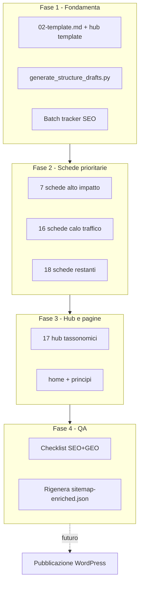

# Piano operativo SEO — liberating.it (fase content/)

## Contesto e vincolo

L'analisi di `[sitemap-enriched.json](sitemap-enriched.json)` ha evidenziato gap sistemici sulle 62 URL live. Il repo ha già **41 bozze** in `[content/strutture/](content/strutture/)` con il modello corretto (1 H1, no emoji, moduli di navigazione), ma:

- il sito live usa ancora il template Avada con 5 H1 emoji
- nessuna scheda ha sezione FAQ / JSON-LD
- non esistono bozze per i **17 hub tassonomici**
- title/meta delle bozze sono in parte generici (`Nome: guida pratica`)

**Scelta confermata:** lavorare solo su `content/` nel repo; pubblicazione WordPress in un secondo momento.




---

## Fase 0 — Fondamenta (1-2 giorni)

### 0.1 Aggiornare i template

**File:** `[content/02-template.md](content/02-template.md)`

Aggiungere al template scheda struttura, **prima** dei moduli Naviga:

```markdown
## Domande frequenti

### {Domanda 1}
{Risposta 2-4 frasi, answer-first}

### {Domanda 2}
{...}

<!--
<script type="application/ld+json">
{ FAQPage schema allineato alle domande sopra }
</script>
-->
```

Regole da incorporare nel template:

- FAQ: 2-4 domande da `[seo/questions_liberatingstructures.txt](seo/questions_liberatingstructures.txt)`
- JSON-LD commentato in fondo file (non attivo finché non si pubblica su WP)
- `title` <= 60 char, `meta_description` <= 155 char
- H1 = nome struttura; keyword primaria in H1 + **In breve**

### 0.2 Creare template hub tassonomici

**Nuovo file:** `content/02-template-hub.md`

Struttura per i 17 hub (`complessita`, `difficolta`, `durata`, `design-thinking`):

```markdown
---
slug: intermedia
taxonomy: difficolta
title: "Liberating Structures intermedie: {beneficio}"
meta_description: "{max 155 char}"
url: "https://liberating.it/difficolta/intermedia/"
---

# {H1 descrittivo con keyword}

**In breve** - {definizione citabile}

## Strutture in questo percorso
{lista linkata da structures_by_taxonomy}

## Quando scegliere questo livello
{2-3 bullet answer-first}

## Domande frequenti
{2-3 FAQ}

## Esplora anche
{link incrociati ad altri hub}
```

**Fonte dati strutture per hub:** `indexes.structures_by_taxonomy` in `[sitemap-enriched.json](sitemap-enriched.json)` (es. `difficolta.intermedia` → elenco slug già mappato).

### 0.3 Aggiornare lo script di generazione bozze

**File:** `[scripts/generate_structure_drafts.py](scripts/generate_structure_drafts.py)`

Modifiche mirate:

- `build_meta_title()`: sostituire pattern generico `guida pratica` con logica keyword-driven (durata/beneficio dalla `informative_summary`)
- `build_meta_desc()`: usare `purpose` da sitemap, tagliare a 155 char
- `render_markdown()`: aggiungere sezione FAQ placeholder + blocco JSON-LD commentato
- Non rigenerare in massa i file già revisionati manualmente (flag `--only-missing` o skip list con `1-2-4-all`)

### 0.4 Creare tracker operativo

**Nuovo file:** `content/seo-batch-tracker.md`

Tabella di stato per ogni URL (62 righe): title OK, meta OK, H1 OK, FAQ OK, link interni OK, pubblicato WP (futuro). Serve a non perdere il filo sui 41+17+4 file.

---

## Fase 1 — Quick win (mezza giornata)

Interventi a basso effort, alto impatto immediato sui file esistenti.


| Intervento          | File                                                                          | Azione                                                                                      |
| ------------------- | ----------------------------------------------------------------------------- | ------------------------------------------------------------------------------------------- |
| Typo "faciltazioni" | futuro `content/hub/complessita/facilitazioni-complesse.md` + nota in tracker | Correggere in title e body                                                                  |
| Meta > 155 char     | 23 URL identificate in sitemap                                                | Accorciare `meta_description` nelle bozze corrispondenti                                    |
| Title > 60 char     | `10-principi`, `complessita/trasformazioni-organizzative`                     | Rivedere frontmatter in `[content/pagine/](content/pagine/)` e hub                          |
| Brand misto         | tutte le schede                                                               | Uniformare suffix: **nessun** `- Liberating Structures`; usare beneficio italiano nel title |


**Regola title schede** (riferimento gold: `[content/strutture/1-2-4-all.md](content/strutture/1-2-4-all.md)`):

> `Keyword: beneficio concreto` — es. `TRIZ: superare i compromessi nel team`

---

## Fase 2 — Schede struttura: SEO on-page (3-4 settimane)

Per ogni file in `[content/strutture/{slug}.md](content/strutture/)` applicare il workflow `[seo-geo-specialist](.cursor/skills/seo-geo-specialist/SKILL.md)` + `[liberating-tone-of-voice](.cursor/skills/liberating-tone-of-voice/SKILL.md)`:

1. Leggere CSV per-URL da `seo/https___liberating.it_structures_{slug}__all_keywords.csv`
2. Scegliere keyword primaria + 2-4 secondarie (Opportunity >= 70, no cannibalizzazione)
3. Aggiornare `title`, `meta_description`, **In breve**, H2 pertinenti
4. Aggiungere `## Domande frequenti` (2-4 domande da `questions_liberatingstructures.txt`)
5. Aggiungere JSON-LD `FAQPage` o `HowTo` commentato
6. Verificare moduli **Prima e dopo / Strutture simili / Torna al catalogo** con anchor descrittivi

### Batch 1 — Priorità assoluta (7 schede, ~3 giorni)


| Scheda                                                                           | Motivo                      | Keyword target (SeoZoom)                               |
| -------------------------------------------------------------------------------- | --------------------------- | ------------------------------------------------------ |
| `[1-2-4-all.md](content/strutture/1-2-4-all.md)`                                 | Score on-page 60, calo -33% | `1 2 4 all` (vol 320, pos 1) — refresh, non riscrivere |
| `[triz.md](content/strutture/triz.md)`                                           | Gap pos 101, vol 480        | `triz`, `triz liberating structures`                   |
| `[open-space-technology-ost.md](content/strutture/open-space-technology-ost.md)` | TP 220                      | `open space technology`, `ost`                         |
| `[social-network-webbing.md](content/strutture/social-network-webbing.md)`       | TP 220                      | keyword da CSV per-URL                                 |
| `[w3-what-so-what-now-what.md](content/strutture/w3-what-so-what-now-what.md)`   | TP 140, pos 33              | `what so what now what`                                |
| `[ecocycle-planning.md](content/strutture/ecocycle-planning.md)`                 | Calo -15%, ecocycle pos 101 | `ecocycle`, `ecocycle liberating structures`           |
| `[drawing-together.md](content/strutture/drawing-together.md)`                   | Traffico reale 89 visite    | keyword da CSV per-URL                                 |


### Batch 2 — Pagine in calo (16 schede, ~1 settimana)

Tutte le URL in `[seo/liberating_it_PagesWithTrafficDown.csv](seo/liberating_it_PagesWithTrafficDown.csv)` con `content_type=structure`: wicked-questions, shift-share, heard-seen-respected-hsr, user-experience-fishbowl, min-specs, discovery-action-dialogue-dad, panarchy, 9-whys, ecc.

Focus: title non generico, FAQ obbligatoria, definizione citabile nei primi 150 parole.

### Batch 3 — Restanti 18 schede (~1 settimana)

Tutte le altre in `content/strutture/` non coperte dai batch 1-2.

---

## Fase 3 — Hub tassonomici (1 settimana)

**Nuova cartella:** `content/hub/{taxonomy}/{slug}.md` (17 file)

### Priorità hub


| Hub                                               | Motivo                                                    | Azione chiave                                                      |
| ------------------------------------------------- | --------------------------------------------------------- | ------------------------------------------------------------------ |
| `difficolta/intermedia`                           | TP **3060**, no H1 live, pos 18 su `liberatingstructures` | H1 descrittivo + lista strutture da `structures_by_taxonomy` + FAQ |
| `difficolta/facile`                               | Calo -3%                                                  | Idem                                                               |
| `complessita/iniziare-subito`                     | Percorso guidato, 10 strutture                            | String completa con link prev/next                                 |
| `complessita/facilitazioni-complesse`             | Typo live                                                 | Correggere + 10 strutture linkate                                  |
| `durata/breve`, `durata/media`, `durata/workshop` | Meta description troppo lunghe live                       | Riscrivere title/meta + elenco strutture                           |
| 6 hub `design-thinking/`*                         | Meta > 155 char su alcuni                                 | Allineare a fasi DT con strutture associate                        |


Ogni hub deve includere:

- **H1 unico** con keyword cluster (da `[seo/clusters_keyword.csv](seo/clusters_keyword.csv)` dove disponibile)
- Sezione `## Strutture in questo percorso` con link a tutte le schede del cluster (dato già in sitemap JSON)
- 2-3 FAQ GEO
- `## Esplora anche` con link ad hub correlati (es. difficolta ↔ complessita)

---

## Fase 4 — Pagine editoriali (2 giorni)


| File                                                                                                                                   | Gap attuale                   | Intervento                                                                       |
| -------------------------------------------------------------------------------------------------------------------------------------- | ----------------------------- | -------------------------------------------------------------------------------- |
| `[content/pagine/home.md](content/pagine/home.md)`                                                                                     | Live senza H1; bozza ha H1 OK | Verificare keyword `liberating structures` (pos 2); aggiungere FAQ; meta refresh |
| `[content/pagine/10-principi-fondamentali-liberating-structures.md](content/pagine/10-principi-fondamentali-liberating-structures.md)` | Title 70 char live            | Accorciare title; FAQ su principi                                                |
| `privacy-policy`, `termini-di-servizio`                                                                                                | Meta assente live             | Bassa priorità SEO; verificare `noindex` in nota per fase WP futura              |


---

## Fase 5 — Internal linking sistematico (parallelo alle fasi 2-3)

Il live site ha `metadata.links` vuoto; le bozze markdown risolvono il problema **se** i moduli sono completi.

### Checklist per ogni scheda

- [ ] Chip tassonomia → hub (`/difficolta/`, `/complessita/`, ecc.)
- [ ] **Prima e dopo**: 1-2 link con motivo (dati curati in `NAV` di `[generate_structure_drafts.py](scripts/generate_structure_drafts.py)`)
- [ ] **Strutture simili**: 2-3 link; integrare anche suggerimenti da `related_by_shared_taxonomy()` in sitemap JSON
- [ ] **Prossimo nel percorso**: per strutture in `complessita/iniziare-subito` e altri percorsi guidati

### Per ogni hub

- [ ] Lista completa strutture del cluster (da `structures_by_taxonomy`)
- [ ] 2-3 link trasversali ad altri hub
- [ ] Link alla home e al catalogo `/structures/`

**Riferimento regole:** `[content/01-architettura.md](content/01-architettura.md)` sezioni internal linking (righe 147-170).

---

## Fase 6 — GEO e structured data (integrata in ogni file)

Per ogni scheda e hub, garantire:


| Elemento GEO         | Dove                            | Criterio                                                     |
| -------------------- | ------------------------------- | ------------------------------------------------------------ |
| Definizione citabile | **In breve** (primi 150 parole) | Comprensibile senza contesto                                 |
| Answer-first         | Prima frase di ogni H2          | Risponde alla domanda implicita del titolo                   |
| FAQ                  | `## Domande frequenti`          | 2-4 domande da `questions_liberatingstructures.txt`          |
| JSON-LD              | Blocco HTML commentato in fondo | `FAQPage` o `HowTo` (schede con passaggi numerati)           |
| Entità correlate     | Corpo testo                     | Solo termini pertinenti da `liberating_it_ContentGap_AI.csv` |


**Obiettivo:** portare Menzioni AI da 0 — oggi tutte le URL in `[seo/liberating_it_MainPages.csv](seo/liberating_it_MainPages.csv)` e `[seo/liberating_it_PagesWithPotential.csv](seo/liberating_it_PagesWithPotential.csv)` hanno `Menzioni AI = 0`.

---

## Fase 7 — QA e validazione (3 giorni, a fine lavori)

### Checklist globale (da skill SEO)

Per ogni file in `content/`:

- `title` <= 60, `meta_description` <= 155
- 1 solo H1, nessun emoji nei titoli
- Keyword primaria in H1 + In breve
- FAQ presente
- Nessuna cannibalizzazione (verifica su `liberating.it_LongTailKeywords.csv`)
- Link interni con anchor descrittivo
- Tono di voce rispettato

### Rigenerare snapshot

```bash
python3 generate_sitemap_json.py
```

Confrontare il nuovo `sitemap-enriched.json` con lo stato attuale per verificare che le bozze approvate, una volta pubblicate, risolvano i gap (H1, FAQ, meta).

### Script di audit locale (opzionale)

Creare `scripts/audit_content_seo.py` che valida tutti i file in `content/`:

- lunghezza title/meta
- presenza H1, FAQ, JSON-LD commentato
- link interni minimi (>= 5 per scheda)

---

## Fase futura (fuori scope) — Pubblicazione WordPress

Da eseguire quando le bozze sono approvate:

1. **Tema Avada:** sostituire layout `structures-template-default` — 1 H1 + H2 senza emoji
2. **Yoast:** incollare `title` e `meta_description` dal frontmatter YAML
3. **Hub:** creare/aggiornare term description WP per i 17 hub
4. **Schema:** attivare JSON-LD FAQ/HowTo (da blocchi commentati)
5. **OG image:** creare asset per top 10 pagine + configurare Yoast social
6. **Breadcrumb:** correggere URL null nel breadcrumb struttura
7. Aggiornare `lastmod` toccando ogni pagina pubblicata

---

## Cronoprogramma indicativo


| Settimana | Deliverable                                                        |
| --------- | ------------------------------------------------------------------ |
| 1         | Fase 0 + Fase 1 + Batch 1 (7 schede) + hub `difficolta/intermedia` |
| 2         | Batch 2 (16 schede) + 8 hub rimanenti prioritari                   |
| 3         | Batch 3 (18 schede) + 9 hub restanti + pagine editoriali           |
| 4         | Fase 7 QA + script audit + rigenerazione sitemap                   |


**Totale file da produrre/aggiornare:** 41 schede + 17 hub + 2 pagine editoriali prioritarie = **60 file** (+ 2 legali a bassa priorità).

---

## Metriche di successo (post-pubblicazione WP)


| Metrica                       | Baseline    | Target           |
| ----------------------------- | ----------- | ---------------- |
| Schede con title non generico | 0/41 live   | 41/41            |
| Pagine con 1 H1               | ~17/62 live | 62/62            |
| Schede con FAQ                | 0/41        | 41/41            |
| Meta description <= 155 char  | 39/62       | 62/62            |
| Menzioni AI (top 10 URL)      | 0           | > 0 entro 3 mesi |
| Posizione `triz`              | 101         | <= 20            |
| Calo `1-2-4-all`              | -33%        | stabilizzazione  |


Fonti baseline: `sitemap-enriched.json`, `liberating_it_PagesWithTrafficDown.csv`, `liberating_it_OnPageSEO.csv`, `liberating_it_PagesWithPotential.csv`.

---

## Appendice — Campagna Google Ads (post-pubblicazione contenuti)

**Prerequisito:** non lanciare ads sulle landing live attuali (5 H1, no FAQ, title generici). Pubblicare prima Batch 1 + hub `iniziare-subito` + home aggiornata, poi attivare ads.

**Obiettivo conversione suggerito:** visita a 2+ schede struttura, ingresso nel percorso guidato, iscrizione newsletter (se attiva). Tutte le keyword rilevanti sono Informational — aspettarsi CPA alto se si misura solo lead.

### Campagna 1 — Brand difensiva (Search)


| Landing    | Keyword                                     | Volume     | Pos organica | CPC        | Motivo                                                                      |
| ---------- | ------------------------------------------- | ---------- | ------------ | ---------- | --------------------------------------------------------------------------- |
| `/` (home) | liberatingstructures, liberating structures | 2900 + 140 | 2            | €0,50–1,05 | Proteggere da agileway.it (pos 9–10) e loci.it; hub verso tutto il catalogo |


Budget: basso-medio. Match type: exact + phrase. Annunci in italiano con USP "35 strutture in italiano, passaggi pronti".

### Campagna 2 — Onboarding guidato (Search)


| Landing                         | Keyword                                                                                     | Motivo                                                                                      |
| ------------------------------- | ------------------------------------------------------------------------------------------- | ------------------------------------------------------------------------------------------- |
| `/complessita/iniziare-subito/` | liberating structures per riunioni online efficaci, percorso iniziare liberating structures | Intent "voglio partire": 10 strutture in sequenza, conversione superiore alla home generica |


Pubblicare hub prima di attivare. CTA annuncio: "5 strutture facili, prova domani".

### Campagna 3 — Strutture "quasi pagina 1" (Search) — priorita' ads

Landing dove organico e' pos 9–30: ads come acceleratore finche' SEO recupera.


| Landing                                  | Keyword principale    | Volume | Pos | CPC   | Perche' sponsorizzare                                                      |
| ---------------------------------------- | --------------------- | ------ | --- | ----- | -------------------------------------------------------------------------- |
| `/structures/open-space-technology-ost/` | open space technology | 210    | 11  | €0    | Vicino a top 10; competitor loci.it (pos 2 PDF), agileway (pos 37)         |
| `/structures/w3-what-so-what-now-what/`  | What So What Now What | 140    | 30  | €0    | Opportunity 91; uso pratico pre-riunione                                   |
| `/structures/social-network-webbing/`    | webbing               | 210    | 12  | €0,56 | Pagina 2; intent specifico                                                 |
| `/structures/shift-share/`               | shift and share       | 30     | 10  | €0    | Gia' pagina 1 borderline                                                   |
| `/structures/panarchy/`                  | panarchy              | 20     | 9   | €0    | Nicchia, bassa competizione                                                |
| `/structures/ecocycle-planning/`         | eco cycle planning    | 90     | 5   | €0    | Organico gia' forte; ads difensiva contro liberatingstructures.com (pos 1) |


### Campagna 4 — Strutture long-tail LS (Search)


| Landing                             | Keyword                                                | Volume      | Pos | Nota                                                     |
| ----------------------------------- | ------------------------------------------------------ | ----------- | --- | -------------------------------------------------------- |
| `/structures/triz/`                 | triz liberating structures, liberating structures triz | 50 ciascuna | 3–4 | Si. NON sponsorizzare "triz" generica (vol 480, pos 101) |
| `/structures/troika-consulting/`    | troika consulting, troika liberating structures        | 10          | 2–4 | CPC zero, intent navigazionale verso LS                  |
| `/structures/conversation-cafe/`    | conversation cafe liberating structures                | 10          | 3   | Stesso pattern                                           |
| `/structures/25-10-crowd-sourcing/` | 25 10 crowdsourcing                                    | 50          | 2   | Organico gia' ottimo — ads solo remarketing              |


### NON sponsorizzare (o solo remarketing)


| Contenuto                                                   | Motivo                                                                                       |
| ----------------------------------------------------------- | -------------------------------------------------------------------------------------------- |
| `/structures/1-2-4-all/`                                    | Pos 1 su "1 2 4 all" (vol 320); budget sprecato in Search                                    |
| `/structures/drawing-together/`                             | Pos 3, 89 visite/mese organiche — gia' performante                                           |
| `/difficolta/intermedia/`                                   | Rankia per keyword sbagliate (liberatingstructures pos 18); landing non allineata all'intent |
| Keyword "facilitazione" (vol 1600)                          | Pos 101, nessuna landing dedicata; scuolafacilitatori.it domina (pos 2)                      |
| Keyword generiche (leadership, change management, riunioni) | Intent troppo ampio, CPC alto, fit contenuto basso                                           |


### Campagna 5 — Remarketing (Display/Performance Max con audience)

- Audience: visitatori di 2+ schede struttura o 30s+ su home
- Landing: `/complessita/iniziare-subito/` o home sezione "Per iniziare domani"
- Costo piu' basso del Search; utile per far tornare chi ha scoperto una singola struttura

### Setup tecnico pre-lancio

1. GA4: eventi `view_structure`, `start_path_iniziare_subito`, `scroll_75`
2. Annunci RSA allineati a title/meta del piano SEO (non copy generico)
3. Estensioni sitelink: 1-2-4-All, Percorso iniziare subito, 10 principi, Catalogo strutture
4. Esclusioni: keyword gia' in pos 1–3 organiche (monitorare in Search Console)
**Raccomandazione:** partire con **Growth a EUR 9,50/giorno** dopo pubblicazione landing Batch 1. Dettaglio completo in [content/ads-budget-plan.md](../../content/ads-budget-plan.md).

