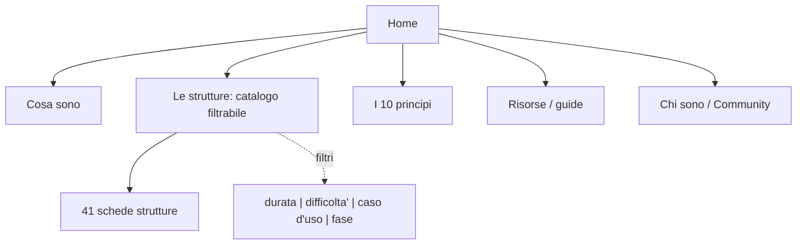

## Ristrutturazione di liberating.it

Sito WordPress in italiano sulle Liberating Structures: 4 pagine editoriali, 41 schede di strutture, 17 tassonomie. Obiettivo: ripensare architettura e riscrivere i contenuti con il nuovo tono di voce, consegnando bozze Markdown da rivedere.

### Tono di voce (deciso insieme)

- Destinatari: manager/team leader e HR/formatori.
- Si da' del "tu". Personalita': pratico + amichevole + esperto.
- Linguaggio semplice (gergo evitato o spiegato), stile conciso e scannerizzabile (frasi brevi, elenchi, grassetti).
- Obiettivo: costruire community e autorevolezza.

### 1. Guida di stile come project skill (fondamenta)

La guida di stile viene concretizzata in una **project skill** in `.cursor/skills/liberating-tone-of-voice/SKILL.md`, cosi' si applica automaticamente ogni volta che si scrive/riscrive un contenuto del sito. Integra i due documenti ufficiali in [docs/linee_guida_copywriting_liberating.pdf](docs/linee_guida_copywriting_liberating.pdf) (ToV, 4 pilastri, architettura) e [docs/linee_guida_scrittura_umana_ai.pdf](docs/linee_guida_scrittura_umana_ai.pdf) (de-automatizzazione). Contiene: profilo (audience + 4 pilastri + distanza zero), regole pratiche, registri per tipo di pagina, do/don't con esempi "prima/dopo", lista "parole da evitare", glossario e i due template. Bozza completa pronta da creare:

```markdown
---
name: liberating-tone-of-voice
description: Tono di voce e stile editoriale del sito liberating.it (Liberating Structures, in italiano). Usare quando si scrivono o riscrivono contenuti per liberating.it - pagine, schede delle strutture, meta SEO, microcopy, CTA. Include regole per una scrittura naturale e non riconoscibile come generata da AI (punteggiatura, ortografia, grammatica, sintassi, semantica).
---

# Tono di voce - liberating.it

Applica queste regole a ogni testo destinato a liberating.it. Per la scrittura naturale (anti-AI) vedi anche [scrittura-naturale.md](scrittura-naturale.md).

## Profilo
- Lettori: manager / team leader e HR / formatori. Persone impegnate che cercano qualcosa di applicabile subito.
- Quattro pilastri verbali, in ordine di priorita': 1) Semplice, 2) Empatico, 3) Pragmatico, 4) Essenziale.
- Distanza zero (rapporto alla pari): scrivi come un facilitatore esperto seduto allo stesso tavolo del lettore. Mai dalla cattedra, mai postura da "guru".
- Semplice non vuol dire banale: riduci il linguaggio, non i risultati. Resta profondo nella sostanza.
- Obiettivo psicologico: abbattere inazione, senso di inadeguatezza e scetticismo verso il cambiamento.
- Obiettivo del sito: costruire community e autorevolezza (non vendere a tutti i costi).

## Regole di scrittura
1. Dai del "tu" singolo. Mai "voi" o "lei". Ammesso il "noi" inclusivo e motivazionale nelle CTA e nei manifesti (Facciamo, Liberiamo, Proviamo).
2. Frasi brevi e lineari (soggetto + verbo + oggetto), di norma sotto le 15-20 parole. Varia pero' il ritmo (vedi burstiness in scrittura naturale): ogni tanto una frase lunga, ogni tanto una di una parola.
3. Verbi attivi e d'azione ("fai parlare tutti", non "viene favorita la partecipazione"). Prediligi imperativi inclusivi (Sperimenta, Adatta, Prova).
4. Scannerizzabile: sottotitoli chiari, elenchi puntati, molto spazio bianco, grassetto solo sulle parole chiave.
5. Metafore solo come strumento logico: analogie pratiche e quotidiane quando servono a spiegare una dinamica complessa. Vietate quelle astratte o magniloquenti.
6. Gergo: evitalo o spiegalo alla prima occorrenza (vedi Glossario).
7. Parti dal beneficio e dal punto di dolore del lettore, non dalla teoria.
8. Numeri concreti meglio di aggettivi ("in 15 minuti"). Per il numero di strutture usa quello ufficiale del brand (35).
9. Una sola CTA per pagina, orientata all'azione autonoma immediata ("Prova la struttura X nella tua riunione di domani"), mai "compra ora".

## Registri per tipo di pagina
Stesso tono di base, tre intensita' diverse. Scegli in base alla pagina:
- Manifesto (diretto, viscerale, incalzante): home, hero, pagine di posizionamento. Frasi taglienti, niente avverbi inutili, dritto al punto di dolore.
- Diario di bordo (conversazionale, empatico, narrativo): blog, risorse, casi di studio. Micro-aneddoti reali, dubbi ammessi, colloquiale controllato.
- Manuale operativo (pragmatico, logico, essenziale): schede strutture, guide, istruzioni. Ultra-pulito, zero fronzoli, focus sull'azione.

## Collegamenti e navigazione (massimizza il tempo di lettura)
Obiettivo: far restare la persona sul sito offrendo sempre un passo successivo naturale, senza forzature ne' trucchi.
- Ogni contenuto deve offrire almeno un proseguimento pertinente: una struttura correlata, un principio, una risorsa.
- Link contestuali inline: alla prima menzione di un'altra struttura o concetto, collegalo alla sua pagina. Il link nasce dal discorso, non e' appiccicato.
- Anchor text descrittivo, col nome reale del contenuto ("vedi 1-2-4-All"), mai "clicca qui" o URL nudi.
- Pochi link, ben scelti: qualita' sopra quantita'. Niente raffiche di link in stile SEO-spam.
- Le schede chiudono con due moduli: "Combinala con" (per creare sequenze) e "Leggi anche" (2-3 strutture correlate per bisogno/fase/durata).
- Le pagine editoriali, prima della CTA finale, offrono 2-3 rimandi correlati come invito (non obbligo) a continuare.
- Usa catalogo filtrabile e percorsi guidati come hub di smistamento; prevedi sempre un ritorno facile al catalogo (breadcrumb / link).

## Parole ed espressioni da evitare
Brand: rivoluzionario, paradigma, olistico, framework, potenziale nascosto, sprigionare/liberare il potenziale, codice genetico, effetto domino / tessera del domino, sinergia, mindset (senza spiegarlo), leva strategica, valore aggiunto, eccellenza, all'avanguardia, formula magica, soluzioni innovative, straordinario/incredibile/unico (superlativi vuoti), empowerment (usa "dare voce / far partecipare").

Tipiche da AI: cruciale, fondamentale (come riempitivo), essenziale (come riempitivo), faro di speranza, un viaggio affascinante, scopriamo insieme, approfondiamo / facciamo un tuffo, immergiamoci, in primo luogo, in un panorama in continua evoluzione, testimonianza di, sottolinea/evidenzia l'importanza, arazzo / intreccio (figurato), vibrante, mozzafiato, incastonato, nel cuore di, rinomato, è importante notare che, vale la pena ricordare, in conclusione il futuro e' luminoso, segna un momento cruciale, lascia un segno indelebile, non solo... ma anche, la vera domanda e', in sostanza / fondamentalmente, ecco cosa devi sapere.

## Scrittura naturale (non sembrare AI)
Obiettivo: il testo deve sembrare scritto da una persona, mai da un modello. Adatta all'italiano la guida "Signs of AI writing". Dettaglio completo in [scrittura-naturale.md](scrittura-naturale.md). Regole minime:

**Punteggiatura e segni**
- Mai trattino lungo (—) ne' lineetta (–) ne' doppio trattino (--). Usa virgola, punto, due punti o parentesi. Gli incisi "a pensiero vivo" rendili con virgole, parentesi o una frase breve separata, mai col trattino.
- Virgolette dritte "..." come standard del sito; mai le curve tipografiche "..." '...'.
- Niente iper-punteggiatura: non accumulare punti esclamativi e domande retoriche per simulare entusiasmo.
- Niente emoji nei titoli o negli elenchi.
- Niente grassetto messo a caso su ogni concetto; grassetto solo sulle 1-2 parole davvero chiave.
- Titoli come frasi normali (solo la prima maiuscola), non Maiuscolo A Ogni Parola.

**Ortografia**
- Accenti corretti (e' -> e'/perche'/poiche' con accento giusto), apostrofi corretti (un'idea, qual e' senza apostrofo), niente inglesismi inutili.

**Grammatica**
- Preferisci "e' / sono / ha" alle perifrasi (rappresenta, costituisce, si configura come, vanta, offre).
- Niente gerundi appiccicati per finta profondita' ("...migliorando la collaborazione", "...sottolineando l'importanza").
- Evita il passivo e le frasi senza soggetto ("Va notato che", "Non e' necessaria alcuna configurazione" -> "Non ti serve...").

**Sintassi**
- Burstiness: alterna in modo netto una frase lunga e articolata (25-30 parole) a una brevissima. Anche di una sola parola. Niente cadenza uniforme "scritta col righello".
- Frasi nominali ed ellittiche ammesse dove lo stile lo consente (frasi senza verbo, risposte secche).
- Bullet volutamente asimmetrici: un punto puo' essere lungo tre righe e il successivo di tre parole. Non standardizzare la struttura dei punti elenco.
- Niente "regola del tre" automatica (terzine tipo "innovazione, ispirazione, idee").
- Niente parallelismi negativi ("Non e' solo X, e' Y") ne' falsi range ("dalla X alla Y" senza scala reale).
- Ripeti pure la stessa parola: niente cicli di sinonimi (protagonista/eroe/figura centrale).

**Semantica**
- Niente enfasi gonfiata su significato/eredita' ne' linguaggio promozionale.
- Niente attribuzioni vaghe ("gli esperti sostengono", "studi dimostrano") senza fonte concreta.
- Niente conclusioni positive generiche ne' aforismi-formula ("X e' il linguaggio di Y").
- Niente aperture retoriche fasulle, meta-annunci ("vediamo nel dettaglio") o frasi da chatbot ("spero ti sia utile", "certo!").
- Se non sai una cosa, dillo o togli la frase: non riempire con congetture.

**Processo (bozza -> controllo -> finale)**
1. Scrivi la bozza.
2. Rileggi e chiediti: "Cosa suona artificiale qui?".
3. Tre domande di sbarramento prima di consegnare:
   - Ci sono parole che un facilitatore reale non userebbe mai in corridoio (fondamentale, cruciale, olistico)? Sostituiscile con verbi o fatti.
   - La lunghezza delle frasi e' troppo omogenea, "scritta col righello"? Spezza o accorcia drasticamente.
   - C'e' un'introduzione didascalica o una conclusione tipo "in conclusione"? Tagliale: inizia e finisci sui fatti.
4. Cerca e elimina ogni `—` e `–`, e converti eventuali virgolette curve in dritte.

## Esempi prima/dopo (dalla home reale)
**Prima:** "Le Liberating Structures sono molto piu' di semplici strumenti di facilitazione - rappresentano un approccio rivoluzionario alla collaborazione e all'interazione nei gruppi di lavoro."
**Dopo:** "Le Liberating Structures sono metodi pratici per far partecipare davvero tutti in riunioni e workshop. Cambi poche cose nel modo in cui il gruppo lavora e ottieni risultati diversi."

**Prima:** "Le microstrutture sono i piccoli elementi che influenzano profondamente il modo in cui interagiamo sul lavoro. Come un codice genetico invisibile, determinano la qualita' delle nostre collaborazioni."
**Dopo:** "Ogni riunione ha una struttura nascosta: chi parla, per quanto, in che ordine. Sono dettagli piccoli, ma decidono quanto il gruppo collabora."

**Prima:** "I piccoli cambiamenti possono innescare trasformazioni sorprendenti. Proprio come una tessera del domino puo' mettere in moto una reazione a catena..."
**Dopo:** "Non servono grandi riforme. Basta cambiare come gestisci la prossima riunione per vedere la differenza."

## Glossario (spiega sempre alla prima occorrenza)
- Facilitazione: guidare un gruppo a lavorare bene insieme, senza imporre le risposte.
- Microstruttura / struttura: il "formato" di un momento di lavoro (es. a coppie, a gruppi di 4, in plenaria).
- Plenaria: tutto il gruppo insieme. Breakout: piccoli gruppi separati.
- Timeboxing: dare un tempo fisso a ogni fase.
- String: una sequenza di piu' strutture concatenate.

## Template - scheda struttura
```markdown
# [Nome struttura]
**In breve** - [a cosa serve in una sola frase]
**Tempo stimato** - [es. 15 minuti]

**Quando usarla** - [2-3 situazioni concrete / punti di dolore]

**I passaggi**
1. [micro-istruzione operativa] - [tempo]
2. [micro-istruzione operativa] - [tempo]

**Il consiglio del facilitatore** - [analogia o trucco pratico d'applicazione]

**Errori da evitare** - [1-3 bullet]

**Combinala con** - [link ad altre strutture per creare sequenze]

**Leggi anche** - [2-3 strutture correlate per bisogno/fase/durata]

---
Durata: ... | Difficolta': ... | Gruppo: ... | Fase: ...
title: ... (max 60 caratteri)
meta description: ... (max 155 caratteri, con beneficio + parola chiave)
```

## Template - pagina editoriale
```markdown
# [Titolo orientato al beneficio]
[Hook: 1-2 frasi che toccano un problema reale del lettore]

**Cosa trovi qui** - [elenco di 2-4 punti]

## [Sottotitolo a beneficio]
[Sezioni brevi, elenchi, grassetti. Link contestuali inline alla prima menzione di strutture/concetti]

**Leggi anche** - [2-3 rimandi correlati come invito a continuare]

## E adesso?
[Una sola CTA verso community o risorsa correlata]
```

## Checklist finale
- [ ] Dato del "tu" (o "noi" inclusivo nelle CTA), mai "voi"/"lei"
- [ ] Registro giusto per la pagina (Manifesto / Diario di bordo / Manuale operativo)
- [ ] Burstiness: lunghezza delle frasi variabile, niente cadenza "col righello"
- [ ] Nessuna parola della lista da evitare (brand + AI)
- [ ] Gergo spiegato o rimosso
- [ ] Beneficio / punto di dolore chiaro nei primi 2 righi
- [ ] Niente intro didascalica ne' conclusione tipo "in conclusione"
- [ ] Una sola CTA orientata all'azione
- [ ] Almeno un proseguimento pertinente (link contestuali + "Leggi anche"), anchor text descrittivo, senza forzature
- [ ] Nessun trattino lungo/lineetta, virgolette dritte, niente emoji
- [ ] Niente regola del tre, parallelismi negativi, gerundi-riempitivo, frasi da chatbot
- [ ] title <=60 e meta description <=155 caratteri
```

Accanto al `SKILL.md` creiamo il file `.cursor/skills/liberating-tone-of-voice/scrittura-naturale.md` (progressive disclosure): catalogo completo dei "segni dell'AI" adattato all'italiano, partendo da [blader/humanizer](https://github.com/blader/humanizer), dalla pagina Wikipedia "Signs of AI writing" e dal manuale di de-automatizzazione del brand. Per ogni pattern: spiegazione breve + esempio "prima/dopo" in italiano (enfasi gonfiata, gerundi-riempitivo, regola del tre, variazione elegante, falsi range, copula evitata, parallelismi negativi, trattini lunghi, virgolette curve, grassetto/emoji meccanici, attribuzioni vaghe, conclusioni generiche, aforismi-formula, aperture retoriche, meta-annunci, frasi da chatbot, hedging eccessivo, riempitivi). Include anche le tecniche di "frizione linguistica" da implementare: burstiness radicale, frasi nominali/ellittiche, asimmetria dei punti elenco, e le 3 domande di sbarramento per la validazione finale.

### 2. Nuova architettura (IA) e navigazione

Le tassonomie attuali (casi d'uso, difficolta', durata, fase design thinking) sono buone ma vanno usate come filtri di un catalogo. Proposta di menu/struttura in `content/01-architettura.md`:




Include: revisione nomi tassonomie per chiarezza, percorsi guidati ("Per iniziare subito", "Per team gia' rodati", ecc.) come pagine di ingresso, criteri di internal linking per autorevolezza/SEO. Per il catalogo, navigazione primaria per bisogno (Generare idee, Prendere decisioni, Analizzare problemi, Fare strategia) invece che alfabetica. Casi d'uso presentati su tre ambiti paritari (Azienda, Scuola/Formazione, Terzo Settore) e una "filosofia dell'hacking" che incoraggia esplicitamente a personalizzare e combinare le strutture.

Obiettivo trasversale: massimizzare il tempo di lettura con una rete di link interni che invita (senza forzare) a passare da un contenuto all'altro. Ogni scheda e ogni pagina espone moduli "Combinala con" e "Leggi anche" (strutture correlate per bisogno/fase/durata), link contestuali inline alla prima menzione, breadcrumb e ritorno facile al catalogo. I percorsi guidati fungono da hub che concatenano piu' strutture in una sequenza sensata.

### 3. Template riutilizzabili

In `content/02-template.md`, i modelli fissi (gli stessi del `SKILL.md`), con indicazione del registro da usare:

- Scheda struttura (registro Manuale operativo): In breve -> Tempo stimato -> Quando usarla -> I passaggi (con tempi) -> Il consiglio del facilitatore -> Errori da evitare -> Combinala con -> box metadati (durata/difficolta'/gruppo/fase).
- Pagina editoriale (registro Manifesto per home/posizionamento, Diario di bordo per blog/risorse): hook sul punto di dolore -> cosa trovi qui -> corpo a sezioni brevi -> una sola CTA all'azione.

### 4. Riscrittura dei contenuti (bozze Markdown)

- `content/pagine/` : home, 10 principi, termini, privacy (le ultime due solo riformattate, non riscritte nei contenuti legali).
- `content/strutture/` : una bozza per ciascuna delle 41 schede seguendo il template. Le procedure delle Liberating Structures sono standard e note; le riscrivo in italiano chiaro mantenendo i nomi originali in inglese.
- Ogni file include i metadati SEO (title, meta description) riscritti.

### Approccio di lavoro

- Iniziamo da guida di stile + architettura + 2 esempi (home + 1 scheda) per validare il tono PRIMA di scalare alle 41 schede.
- Tutto resta in file Markdown; nessuna modifica a WordPress finche' non approvi.
- Contenuti basati sul tema noto delle Liberating Structures; per dettagli specifici del tuo sito attuale posso rileggere le pagine live se vuoi mantenere passaggi esistenti.

### Da confermare prima di partire

- Va bene la cartella `content/` nella root del progetto per le bozze?
- Per le 41 schede: procedo a blocchi (es. 5-10 alla volta) con tua revisione tra un blocco e l'altro?

