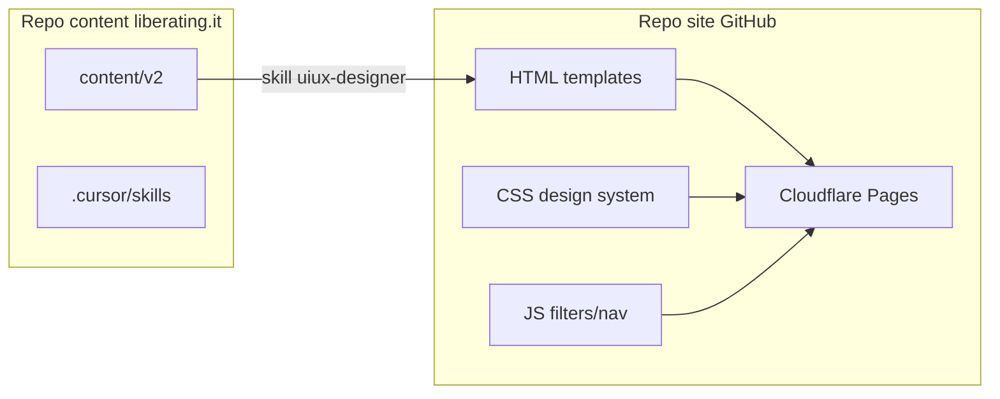
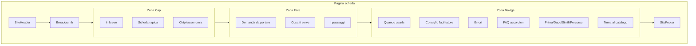

# Skill UI/UX Designer per liberating.it statico

## Contesto

Il repo attuale (`[/var/www/liberating.it](/var/www/liberating.it)`) e' **content-only**: 41 schede in `[content/v2/strutture/](/var/www/liberating.it/content/v2/strutture/)`, IA in `[content/v2/01-architettura.md](/var/www/liberating.it/content/v2/01-architettura.md)`, template in `[content/v2/02-template.md](/var/www/liberating.it/content/v2/02-template.md)`. Non esiste frontend, design system ne' config Cloudflare.

Il sito statico vivra' in un **repo GitHub separato** (es. `liberating-it-site`). La skill deve collegare i due mondi: contenuto Markdown v2 → interfaccia implementabile.




---

## Obiettivo della skill

Insegnare all'agente a:

1. **Leggere** l'architettura v2 e inferire layout, componenti e flussi di navigazione
2. **Progettare** un design system coerente con il tono di voce (pratico, scannable, distanza zero)
3. **Strutturare** file HTML/CSS/JS vanilla pronti per Cloudflare Pages
4. **Configurare** deploy GitHub → Cloudflare Pages con URL invariati e redirect SEO

Pattern da replicare: skill esistenti `[ls-content-specialist](/var/www/liberating.it/.cursor/skills/ls-content-specialist/SKILL.md)` (workflow + checklist + file di riferimento) e `[seo-geo-specialist](/var/www/liberating.it/.cursor/skills/seo-geo-specialist/SKILL.md)` (integrazione con altre skill, progressive disclosure).

---

## Struttura file da creare

```
.cursor/skills/uiux-designer/
├── SKILL.md                 # Workflow principale (~250-350 righe)
├── design-system.md         # Token, tipografia, palette, spacing, breakpoint
├── componenti.md            # Spec HTML/CSS per ogni componente UI
├── template-pagine.md       # Layout per tipo pagina (home, scheda, catalogo, hub)
├── mapping-contenuti.md     # Frontmatter MD → dati HTML/JSON
└── cloudflare-pages.md      # Repo, build, _headers, _redirects, GitHub Actions
```

Opzionale ma consigliato: regola Cursor `[.cursor/rules/uiux-designer.mdc](/var/www/liberating.it/.cursor/rules/uiux-designer.mdc)` che attiva la skill quando si lavora su path del repo site (se clonato in workspace) o su richiesta esplicita.

---

## Contenuto di SKILL.md

### Frontmatter

```yaml
name: uiux-designer
description: Progetta interfaccia e struttura grafica del sito statico liberating.it (HTML+JS+CSS) a partire da content/v2/, con design system, componenti, template pagina e deploy Cloudflare Pages via GitHub. Usare quando si crea o modifica il frontend, wireframe, CSS, layout schede strutture, catalogo filtrabile, o si configura il repo site separato.
```

### Sezioni principali

**1. Prima di progettare** — leggere in ordine:

- `[content/v2/01-architettura.md](/var/www/liberating.it/content/v2/01-architettura.md)` (menu, hub, URL, 3 zone)
- `[content/v2/02-template.md](/var/www/liberating.it/content/v2/02-template.md)` (moduli obbligatori)
- Esempio reale: `[content/v2/strutture/1-2-4-all.md](/var/www/liberating.it/content/v2/strutture/1-2-4-all.md)`
- `[liberating-tone-of-voice](/var/www/liberating.it/.cursor/skills/liberating-tone-of-voice/SKILL.md)` per microcopy UI (CTA, label, aria-label)
- `[seo-geo-specialist](/var/www/liberating.it/.cursor/skills/seo-geo-specialist/SKILL.md)` per `<title>`, meta, JSON-LD FAQ, struttura heading

**2. Direzione visiva default** (modificabile, documentata in `design-system.md`):


| Principio                            | Implicazione UI                                                                        |
| ------------------------------------ | -------------------------------------------------------------------------------------- |
| Manuale operativo, non vetrina       | Layout arioso, tipografia leggibile, zero decorazioni superflue                        |
| Scannerizzabile in 10 sec (zona Cap) | Hero/above-the-fold con gerarchia chiara; scheda rapida come card compatta             |
| Inclusione e autonomia               | CTA unica per pagina; navigazione prev/next visibile; filtri accessibili               |
| v2 rompe con WP legacy               | **No emoji** negli heading; niente stile Avada/Fusion; layout 3 zone, non 5 sezioni WP |
| Community gratuita                   | Nessun pattern e-commerce; footer leggero; niente popup aggressivi                     |


**Palette e tipografia proposta** (default in `design-system.md`, da validare visivamente):

- Font: system stack (`system-ui, -apple-system, Segoe UI, sans-serif`) + optional `Source Serif 4` per titoli editoriali — zero dipendenze Google Fonts se possibile (performance CF)
- Colori: neutri caldi (sfondo `#FAFAF8`, testo `#1A1A1A`), accento unico per link/CTA/chip attivi (es. teal `#0D7377` o arancio LS `#E85D04` — la skill documenta entrambe, sceglie una come default)
- Spacing: scala 4/8/16/24/32/48/64 px; max-width contenuto **72ch** per body, **1200px** per layout pagina (simile al live ~1248px ma piu' leggibile)
- Componenti: border-radius moderato (6-8px), ombre leggere solo su card catalogo

**3. Tipi di pagina → template HTML** (dettaglio in `template-pagine.md`):


| Tipo              | Sorgente contenuto                             | Sezioni UI                                                                                                                                            |
| ----------------- | ---------------------------------------------- | ----------------------------------------------------------------------------------------------------------------------------------------------------- |
| Home              | `content/v1/pagine/home.md` (da portare in v2) | Hero, Problema, Soluzione, Per iniziare, CTA, Leggi anche                                                                                             |
| Catalogo          | IA § catalogo                                  | Sidebar/chip filtri + griglia card struttura                                                                                                          |
| Scheda struttura  | `content/v2/strutture/*.md`                    | **Cap** (breadcrumb, in breve, tabella, chip) → **Fare** (domanda, prep, passaggi) → **Naviga** (quando, consiglio, errori, FAQ accordion, correlati) |
| Hub tassonomia    | IA § filtri                                    | Intro hub + lista strutture filtrate + breadcrumb                                                                                                     |
| Hub "Per bisogno" | IA § sottomenu                                 | 4 colonne/card obiettivo con strutture tipiche                                                                                                        |
| Editoriale        | template v2 pagine                             | Hook, Cosa trovi qui, body, Leggi anche, E adesso?                                                                                                    |
| Legale            | privacy/termini                                | Layout minimale, indice laterale opzionale                                                                                                            |


**4. Libreria componenti** (dettaglio in `componenti.md`):

- `SiteHeader` — logo, nav principale, menu mobile (hamburger + focus trap)
- `Breadcrumb` — schema.org BreadcrumbList
- `QuickInfoTable` — scheda rapida (durata, difficolta', gruppo, fase)
- `TaxonomyChips` — link filtrabili verso `/complessita/`, `/difficolta/`, ecc.
- `StepList` — passaggi numerati con badge tempo
- `FaqAccordion` — `<details>` nativo o JS leggero; allineato a JSON-LD FAQPage
- `PathNav` — prev/next percorso "Per iniziare subito"
- `RelatedLinks` — Prima/Dopo, Simili, Torna al catalogo
- `StructureCard` — card catalogo (titolo, in breve, chip, link)
- `FilterBar` — facet JS client-side su `data-`* attributes
- `CtaBlock` — singola CTA per pagina
- `SiteFooter` — link legali, catalogo, community

Ogni componente: markup HTML semantico, classi BEM (`ls-card`, `ls-chip`, `ls-breadcrumb`), stati hover/focus/active, note ARIA.

**5. Mapping contenuti Markdown → HTML** (`mapping-contenuti.md`):

- Frontmatter YAML → `<meta>`, Open Graph, attributi `data-slug`, `data-difficolta`, ecc.
- Breadcrumb testuale MD → `<nav aria-label="Breadcrumb">`
- Tabella MD → `<table>` responsive (stack su mobile)
- FAQ `### domanda` → accordion + script JSON-LD (decommentare da MD)
- Strategia build: **script Node/Python nel repo site** che legge `content/v2/` (submodule, git subtree, o CI checkout del repo content) e genera HTML statico — la skill documenta entrambi i flussi (pre-render vs. hand-coded con JSON index)

**6. Struttura repo site separato** (`cloudflare-pages.md`):

```
liberating-it-site/
├── index.html
├── structures/
│   ├── index.html              # catalogo
│   └── {slug}/index.html       # 41 schede
├── complessita/{slug}/index.html
├── difficolta/{slug}/index.html
├── durata/{slug}/index.html
├── design-thinking/{slug}/index.html
├── assets/
│   ├── css/
│   │   ├── tokens.css          # custom properties
│   │   ├── base.css
│   │   └── components.css
│   └── js/
│       ├── nav.js
│       ├── filters.js
│       └── faq.js
├── _headers                    # cache, security headers
├── _redirects                  # trailing slash, legacy WP URLs
├── .github/workflows/deploy.yml
└── README.md
```

**Cloudflare Pages:**

- Build command: `npm run build` o `python scripts/build.py` (genera HTML da content)
- Output directory: `dist/` o root se no build
- `_headers`: cache lunga su `/assets/`*, no-cache su HTML, `X-Content-Type-Options`, CSP base
- `_redirects`: preservare 62 URL da `[sitemap-enriched.json](/var/www/liberating.it/sitemap-enriched.json)`; trailing slash coerente

**GitHub Actions** (workflow minimale):

- Trigger: push su `main`
- Steps: checkout content repo → build → deploy via Cloudflare Pages action (`cloudflare/pages-action`)

**7. Workflow operativo** (checklist in SKILL.md):

```
Task Progress:
- [ ] 1. Leggere 01-architettura + 02-template + scheda esempio
- [ ] 2. Identificare tipo pagina e moduli obbligatori
- [ ] 3. Applicare design system (design-system.md)
- [ ] 4. Comporre HTML semantico con componenti (componenti.md)
- [ ] 5. Verificare microcopy con tone-of-voice
- [ ] 6. Verificare SEO: title, meta, H1, JSON-LD FAQ (seo-geo-specialist)
- [ ] 7. Test responsive (mobile-first) e accessibilita' (focus, contrasto, accordion)
- [ ] 8. Aggiornare _redirects se nuovi slug
- [ ] 9. Validare build locale + preview CF
```

**8. Integrazione con altre skill**


| Skill                    | Ruolo nel frontend                      |
| ------------------------ | --------------------------------------- |
| liberating-tone-of-voice | Label, CTA, aria-label, no emoji        |
| seo-geo-specialist       | Meta, FAQ schema, heading structure     |
| ls-content-specialist    | Coerenza moduli 3 zone, chip tassonomia |


Regola conflitto: **accessibilita' e leggibilita' > decorazione**; **tone-of-voice > copy marketing UI**.

**9. Cosa NON fare** (anti-pattern espliciti):

- Framework CSS pesanti (Bootstrap, Tailwind) — vanilla CSS con custom properties
- SPA/router client-side per contenuto indicizzabile — pagine HTML statiche per ogni URL
- Copiare layout WP a 5 sezioni con emoji
- Multipli CTA competizione sulla stessa pagina
- Font/icon pack esterni non necessari

---

## Diagramma layout scheda struttura (riferimento per la skill)




---

## Deliverable dell'implementazione

Al termine dell'implementazione del piano:

1. **6 file skill** in `.cursor/skills/uiux-designer/` come sopra
2. **Regola Cursor** `.cursor/rules/uiux-designer.mdc` con trigger su keyword (frontend, HTML, CSS, Cloudflare Pages, site repo) e path pattern
3. **Aggiornamento** descrizione nel README o indice skill del progetto (solo se esiste un indice — altrimenti skip)

La skill **non** crea il repo site né il codice HTML in questa fase — produce solo la knowledge base per guidare l'agente quando l'utente chiedera' di costruire il frontend.

---

## Note sul collegamento repo separato

La skill documentera' 3 modalita' di sync content → site (l'utente sceglie in implementazione):

1. **Git submodule** — `content/` punta al repo liberating.it
2. **GitHub Actions checkout** — workflow scarica l'ultimo `content/v2/` al build
3. **Export manuale** — script copia MD in `site/content/`

Default consigliato nella skill: **GitHub Actions checkout** (repo site indipendente, build sempre aggiornato).