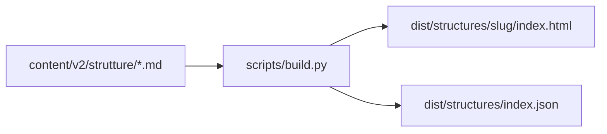

# Mapping contenuti - liberating.it

Traduzione da Markdown `content/v2/` a HTML statico nel repo site. Il build script vive nel repo site (`scripts/build.py` o `scripts/build.mjs`).

---

## Flusso build



1. Checkout repo content (CI) o submodule locale
2. Parse frontmatter YAML + body Markdown
3. Genera HTML per ogni URL
4. Genera `structures/index.json` per filtri client-side
5. Copia `assets/`, `_headers`, `_redirects` in `dist/`

---

## Frontmatter YAML → HTML head

| Campo YAML | Output HTML |
|------------|-------------|
| `title` | `<title>{title} \| Liberating.it</title>` (se non gia' include brand) |
| `meta_description` | `<meta name="description" content="...">` |
| `url` | `<link rel="canonical" href="...">` |
| `slug` | `data-slug` su `<article>`, path output |
| `durata` | QuickInfoTable + mapping `data-durata` |
| `difficolta` | QuickInfoTable + `data-difficolta` (slugificato) |
| `partecipanti` | QuickInfoTable riga Gruppo |
| `fase` | QuickInfoTable + `data-fase` |
| `complessita` | chip + `data-complessita` |
| `registro` | `class` modulatore (`ls-article--manuale-operativo`) |

### Open Graph (minimo)

```html
<meta property="og:title" content="{title}">
<meta property="og:description" content="{meta_description}">
<meta property="og:url" content="{url}">
<meta property="og:type" content="article">
<meta property="og:locale" content="it_IT">
```

---

## Slugificazione tassonomie

Valori frontmatter → slug URL e `data-*`:

| Campo | Valore esempio | Slug `data-*` |
|-------|----------------|---------------|
| difficolta | Facile | `facile` |
| difficolta | Intermedia | `intermedia` |
| difficolta | Avanzata | `avanzata` |
| complessita | Per iniziare subito | `iniziare-subito` |
| complessita | Per team gia' rodati | `team-rodati` |
| complessita | Per facilitazioni complesse | `facilitazioni-complesse` |
| complessita | Per trasformazioni organizzative | `trasformazioni-organizzative` |
| fase | Ideate | `ideate` |
| fase | Multi fase | `multi-fase` |
| durata (derivata) | 15 minuti | `breve` |
| durata (derivata) | 90 minuti | `media` |

**Mapping durata:** usa logica da `sitemap-enriched.json` o tabella in build script:

| Pattern durata YAML | Bucket `data-durata` |
|---------------------|----------------------|
| <= 45 min | `breve` |
| <= 90 min | `media` |
| <= 4 h | `estesa` |
| workshop, +1g, variabile lunga | `workshop` |

---

## Sezioni Markdown → componenti

| Sezione MD (`##`) | Componente HTML |
|-------------------|-----------------|
| (riga dopo H1) breadcrumb testuale | `ls-breadcrumb` |
| **In breve** - testo | `ls-cap__brief` |
| Tabella 4 colonne | `ls-quick-info` |
| **Filtri:** chip line | `ls-chips` |
| Domanda da portare | `<h2>` + `<ul>` |
| Cosa ti serve | `<h2>` + `<ul>` |
| I passaggi | `<h2>` + `ls-step-list` |
| Quando usarla | `<h2>` + `<ul>` |
| Il consiglio del facilitatore | `<h2>` + `<p>` |
| Errori da evitare | `<h2>` + `<ul>` |
| Domande frequenti | `ls-faq` (`###` → `<details>`) |
| Prima e dopo | `ls-related` gruppo |
| Strutture simili | `ls-related` gruppo |
| Prossimo nel percorso | `ls-path-nav` |
| Torna al catalogo | `ls-related__back` |

### Parsing passaggi

Riga MD: `1. Poni la domanda - 1 min`

```html
<li class="ls-step">
  <span class="ls-step__number">1</span>
  <div class="ls-step__content">
    <p class="ls-step__action">Poni la domanda</p>
    <span class="ls-step__time">1 min</span>
  </div>
</li>
```

Separatore: ` - ` (spazio-trattino-spazio), non em dash.

### Parsing Prima/Dopo

Riga: `- **Prima:** [Nome](/structures/slug/) - motivo`

Estrai: tipo (prima/dopo), slug, nome link, motivo.

---

## FAQ e JSON-LD

### Da Markdown

```markdown
### Cos'e' 1-2-4-All?
Risposta in 2-4 frasi.
```

### A HTML

```html
<details class="ls-faq__item">
  <summary>Cos'e' 1-2-4-All?</summary>
  <div class="ls-faq__answer"><p>Risposta...</p></div>
</details>
```

### A JSON-LD

Decommenta e popola lo schema dal commento HTML in fondo al file MD:

```html
<script type="application/ld+json">
{
  "@context": "https://schema.org",
  "@type": "FAQPage",
  "mainEntity": [
    {
      "@type": "Question",
      "name": "Cos'e' 1-2-4-All?",
      "acceptedAnswer": {
        "@type": "Answer",
        "text": "..."
      }
    }
  ]
}
</script>
```

Il testo in `acceptedAnswer.text` deve corrispondere alla risposta visibile (requisito SEO/GEO).

---

## structures/index.json

Generato in build per `filters.js`:

```json
{
  "structures": [
    {
      "slug": "1-2-4-all",
      "title": "1-2-4-All: far parlare tutti in 15 minuti",
      "brief": "Fai emergere idee da tutti in quattro passaggi...",
      "difficolta": "facile",
      "complessita": "iniziare-subito",
      "durata": "breve",
      "fase": "ideate",
      "url": "/structures/1-2-4-all/",
      "sort_order": 2
    }
  ],
  "path_order": [
    "impromptu-networking",
    "1-2-4-all",
    "w3-what-so-what-now-what",
    "15-solutions",
    "troika-consulting"
  ]
}
```

`sort_order` per catalogo default: ordine in `path_order` prima, poi per `complessita`, poi alfabetico.

---

## PathNav (percorso guidato)

Hardcode in build script (allineato a `PATH_ORDER` in [generate_structure_v2.py](../../../scripts/generate_structure_v2.py)):

```python
PATH_ORDER = [
    "impromptu-networking",
    "1-2-4-all",
    "w3-what-so-what-now-what",
    "15-solutions",
    "troika-consulting",
]
```

Per ogni slug in `PATH_ORDER`, genera `ls-path-nav` con prev/next. Per altre strutture con `complessita: Per iniziare subito` ma fuori PATH_ORDER, ometti PathNav o mostra solo link al percorso.

---

## Hub pages (pre-render)

Il build genera pagine hub statiche filtrando `index.json`:

| URL | Filtro |
|-----|--------|
| `/complessita/iniziare-subito/` | `complessita == iniziare-subito` |
| `/difficolta/facile/` | `difficolta == facile` |
| `/durata/breve/` | `durata == breve` |
| `/design-thinking/ideate/` | `fase == ideate` |

---

## Strategie build

### A. Pre-render completo (consigliato)

Script Python nel repo site:

```
pip install python-frontmatter markdown jinja2
python scripts/build.py --content ../liberating.it/content/v2 --out dist
```

Template Jinja2 per scheda, catalogo, hub. Massima SEO, zero dipendenza JS per contenuto.

### B. JSON index + shell HTML

Hand-coded template HTML; build genera solo JSON e inietta contenuto via JS.

**Non consigliato** per SEO principale — usare solo per prototipo.

### C. Ibrido

HTML pre-render per schede e hub; `filters.js` client-side sul catalogo con `index.json`.

**Default consigliato:** strategia **A** o **C**.

---

## Checklist mapping

- [ ] Ogni scheda ha `<title>`, meta, canonical da frontmatter
- [ ] `data-*` su article corrispondono ai chip
- [ ] Breadcrumb posizione 1 = Home, ultima = current page
- [ ] FAQ HTML = FAQ JSON-LD (stesso testo)
- [ ] Passaggi parsati con tempi
- [ ] PathNav solo per PATH_ORDER
- [ ] `index.json` aggiornato ad ogni build
- [ ] URL output con trailing slash (`/structures/slug/`)
