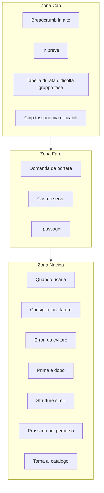
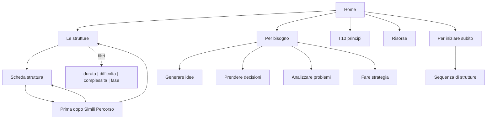

# Architettura informativa - liberating.it

Documento di riferimento per menu, navigazione, tassonomie e internal linking del nuovo sito.

## Obiettivi

1. **Accessibilita' immediata:** chi arriva capisce in 10 secondi cosa sono le Liberating Structures e cosa puo' fare subito.
2. **Catalogo per bisogno:** trovare la struttura giusta per il problema, non per ordine alfabetico.
3. **Tempo di lettura:** rete di link interni che invita (senza forzare) a passare da un contenuto all'altro.
4. **Community e autorevolezza:** il sito e' risorsa gratuita e punto di riferimento, non vetrina commerciale.

## Menu principale

```
Home
Le strutture          → catalogo filtrabile
Per bisogno           → hub per obiettivo (vedi sotto)
I 10 principi
Risorse               → blog, casi d'uso, guide
Chi siamo / Community
```

### Sottomenu "Per bisogno"

Navigazione primaria per obiettivo, non alfabetica:

| Hub | Strutture tipiche | Pubblico |
|-----|-------------------|----------|
| Generare idee | 1-2-4-All, Brainwriting, TRIZ, 25/10 | Team bloccati, workshop creativi |
| Prendere decisioni | Min Specs, Agreement/Certainty Matrix, What I Need From You | Riunioni che non concludono |
| Analizzare problemi | 9 Whys, Discovery & Action Dialogue, Ecocycle | Situazioni complesse, cause profonde |
| Fare strategia | Critical Uncertainties, Open Space, Purpose to Practice | Trasformazioni, pianificazione |

### Hub "Per iniziare"

Percorsi guidati che concatenano strutture in sequenza sensata (string):

- **Per iniziare subito** (5 strutture facili, max 45 min): Impromptu Networking → 1-2-4-All → What, So What, Now What? → 15% Solutions → Troika Consulting
- **Per team gia' rodati** (13 strutture): strutture intermedie per gruppi con esperienza
- **Per facilitazioni complesse** (workshop multi-ora)
- **Per trasformazioni organizzative** (workshop +1g)

## Catalogo strutture (filtri)

Il catalogo `/structures/` usa i filtri esistenti come facet:

| Tassonomia | Valori | Uso |
|------------|--------|-----|
| `complessita` | Per iniziare subito, Per team gia' rodati, Per facilitazioni complesse, Per trasformazioni organizzative | Livello di esperienza richiesta |
| `difficolta` | Facile, Intermedia, Avanzata | Difficolta' di conduzione |
| `durata` | Breve (max 45 min), Media (max 90 min), Estesa (max 4 h), Workshop (+1g) | Tempo necessario |
| `design-thinking` | Empathize, Define, Ideate, Prototype, Test, Multi fase | Fase del processo creativo |

**Default del catalogo:** ordinamento per bisogno (hub), non alfabetico. Filtri visibili in sidebar o chip sopra la griglia.

## Struttura pagina Home

Registro: **Manifesto**

1. **Hero** - Titolo dritto ("Cambia il modo in cui il tuo team lavora, decide e crea"). Sottotitolo con il numero di strutture nel catalogo (dinamico in build). CTA: "Scegli una struttura da provare domani".
2. **Il problema (empatia)** - Elenco scansionabile: riunioni infinite, stessi due che parlano, idee nel cassetto.
3. **La soluzione (pragmatismo)** - Tre caratteristiche: inclusione, semplicita', autonomia. Link al catalogo.
4. **Per iniziare** - 3-4 strutture consigliate con link diretto.
5. **CTA finale** - "Prova [struttura X] nella tua riunione di domani".

## Struttura pagina scheda (modello a 3 zone)

Registro: **Manuale operativo**. Vedi template in [02-template.md](02-template.md).



### Moduli e obiettivo navigazione

| Modulo | Zona | Obiettivo |
|--------|------|-----------|
| Breadcrumb + scheda rapida + chip | Cap | Orientamento immediato, filtri verso catalogo |
| Domanda da portare + Cosa ti serve + Passaggi | Fare | Agire subito senza scroll eccessivo |
| Quando usarla / Consiglio / Errori | Naviga | Contesto e qualita' |
| Prima e dopo | Naviga | String (sequenze) |
| Strutture simili | Naviga | Alternative stesso livello |
| Prossimo nel percorso | Naviga | Prev/next nel percorso guidato |
| Torna al catalogo | Naviga | Uscita soft + correlati |

### Chip tassonomia (scheda rapida)

Ogni scheda espone link cliccabili verso gli hub:

| Tassonomia | URL pattern | Esempio |
|------------|-------------|---------|
| `complessita` | `/complessita/{slug}/` | Per iniziare subito |
| `difficolta` | `/difficolta/{slug}/` | Facile |
| `durata` | `/durata/{slug}/` | Breve (max 45 min) |
| `design-thinking` | `/design-thinking/{slug}/` | Ideate |

### Percorso "Per iniziare subito" (prev/next)

Sequenza fissa per navigazione lineare:

1. [Impromptu Networking](/structures/impromptu-networking/)
2. [1-2-4-All](/structures/1-2-4-all/)
3. [What, So What, Now What?](/structures/w3-what-so-what-now-what/)
4. [15% Solutions](/structures/15-solutions/)
5. [Troika Consulting](/structures/troika-consulting/)

Ogni struttura del percorso mostra `← Precedente · → Successiva` in **Prossimo nel percorso**.

## Casi d'uso e risorse

### Tre ambiti paritari (stesso piano, stesso tono)

- **Azienda** - riunioni, team, trasformazioni organizzative
- **Scuola / Formazione** - aula, workshop formativi, didattica attiva
- **Terzo Settore** - assemblee, volontariato, comunita'

### Filosofia dell'hacking

Ogni pagina risorse e ogni scheda incoraggia esplicitamente a:
- personalizzare tempi e passaggi
- combinare strutture in string
- adattare al contesto (remoto, ibrido, piccoli/grandi gruppi)

Messaggio tipo: "Questa e' la versione base. Prendila, tagliala, uniscila ad altre. Funziona meglio se la adatti."

## Internal linking (massimizza tempo di lettura)

### Regole

1. **Link contestuali inline** alla prima menzione di struttura o concetto correlato.
2. **Anchor text descrittivo** con nome reale ("vedi [1-2-4-All](/structures/1-2-4-all/)"), mai "clicca qui".
3. **Pochi link, ben scelti** (2-5 per pagina editoriale, 3-6 per scheda).
4. **Moduli finali** su ogni scheda: Prima e dopo, Strutture simili, Prossimo nel percorso (se applicabile), Torna al catalogo.
5. **Percorsi guidati** come hub che linkano sequenze complete con prev/next.
6. **Breadcrumb in alto** e link "Torna al catalogo" in fondo.

### Matrice di correlazione (esempi)

| Struttura | Prima | Dopo | Simili |
|-----------|-------|------|--------|
| 1-2-4-All | Impromptu Networking | W³ | 4-2-1-Storming, 15% Solutions |
| 9 Whys | Wicked Questions | TRIZ | Min Specs, Discovery & Action Dialogue |
| Open Space Technology | Shift & Share | Purpose to Practice | Ecocycle Planning, Design StoryBoards |

### SEO interno

- Ogni struttura linka almeno 2 altre strutture e 1 pagina editoriale (principi o risorse).
- Hub "Per bisogno" linkano a 5-8 strutture ciascuno.
- Home linka a 4 hub + 4 strutture "per iniziare".

## URL e slug (invariati)

```
/                                    → Home
/structures/                         → Catalogo
/structures/{slug}/                  → Scheda struttura
/10-principi-fondamentali-liberating-structures/
/complessita/{slug}/                 → Hub percorso guidato
/difficolta/{slug}/                  → Filtro difficolta'
/durata/{slug}/                      → Filtro durata
/design-thinking/{slug}/             → Filtro fase
/termini-di-servizio/
/privacy-policy/
```

## Diagramma navigazione


